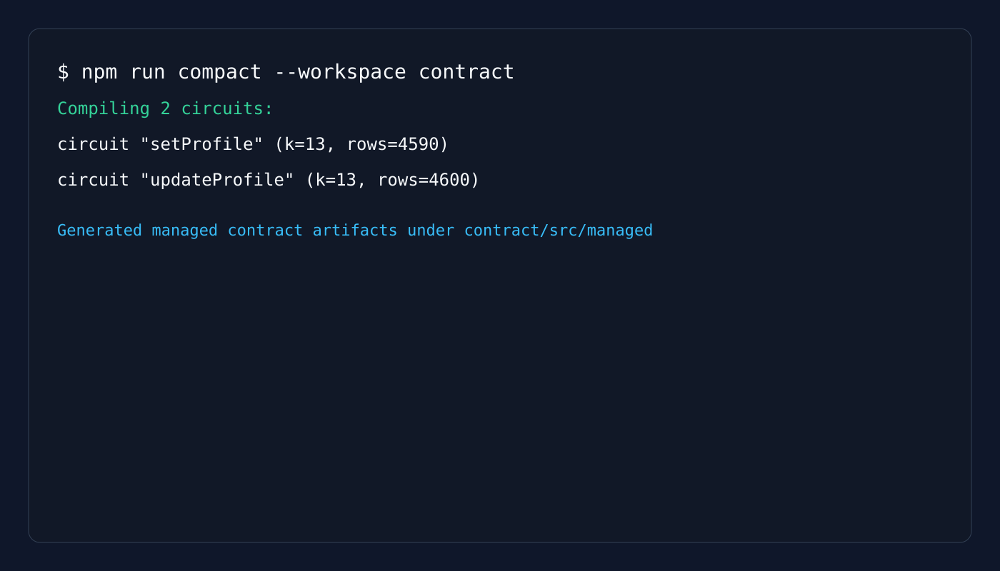
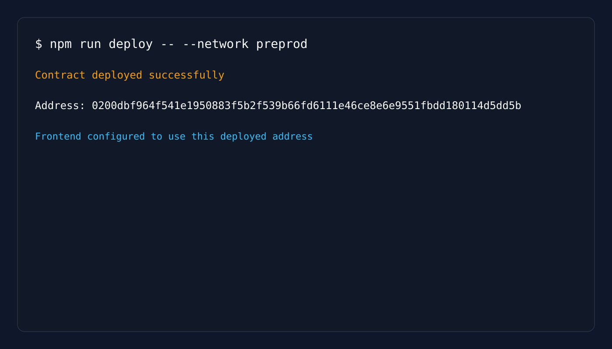

# Profile DApp

A privacy-preserving Midnight profile dapp where users can create or update a profile entry on-chain while keeping the proof of ownership private.

## Contract Address

| Network | Contract Address |
|---------|------------------|
| Preprod | `0200dbf964f541e1950883f5b2f539b66fd6111e46ce8e6e9551fbdd180114d5dd5b` |

## Features

- Create a profile with a public name and bio
- Update the profile only when the current wallet owns it
- Prove wallet ownership without revealing the private secret key
- Connect to Midnight through the Lace wallet
- Build and run a production-style frontend with a Compact contract backend

## What This Project Does

This application lets a user publish a verifiable profile record to a Midnight contract. The public ledger stores profile metadata, while the wallet ownership proof remains private and is validated by the Compact contract during updates.

The Compact contract source lives in [contract/src/profile.compact](contract/src/profile.compact) and [contract/src/bboard.compact](contract/src/bboard.compact), and the generated managed bindings are stored under [contract/src/managed](contract/src/managed).

## Public State vs Private Witness

The contract separates what is visible on-chain from what is proven privately:

- Public state: the profile name, bio, sequence number, and owner public key are stored in the ledger for everyone to inspect.
- Private witness: the wallet secret material used to derive the ownership proof is never exposed publicly and is only used inside the witness flow.
- What is proven without revealing: ownership of the profile without revealing the wallet secret or raw wallet material.

## Initial Product Idea

This project was designed to make it easier to publish a verifiable profile on Midnight without sacrificing privacy. It combines a Compact smart contract, a React frontend, and a CLI so that profile updates can be proven on-chain while keeping the underlying wallet secret private.

## Tech Stack

- Midnight Compact
- TypeScript
- React + MUI
- RxJS
- Vite
- Node.js

## Folder Structure

- contract/: Compact contract and generated bindings
- api/: shared API layer for deployment and contract interaction
- bboard-cli/: CLI entrypoint for wallet-driven contract interaction
- bboard-ui/: React web interface for profile creation and updates

## Prerequisites

- Node.js v22 or newer
- Docker Desktop running
- Lace wallet extension installed
- Access to a Midnight proof server

## Local Setup

```bash
npm install
npm run compact --workspace contract
npm run build
npm run dev:ui
```

Then open the local Vite URL shown in the terminal (usually http://localhost:5173).

## Build and Compile

```bash
npm run compact --workspace contract
npm run build
```

## Screenshots

- Successful compile output:
  

- Contract deployment with address shown:
  

## Deployment Notes

The project is wired to the preprod contract address above. Update the address in [bboard-ui/src/config/contract.ts](bboard-ui/src/config/contract.ts) if you deploy a new contract instance.

## Environment Variables

- VITE_NETWORK_ID: selected Midnight network
- VITE_LOGGING_LEVEL: logging verbosity for the UI
- CONTRACT_ADDRESS: contract address used by the frontend configuration

## Troubleshooting

- If the frontend cannot connect to Lace, confirm that the wallet extension is authorized and the proof server is running.
- If the contract fails to compile, rerun the Compact compiler from the contract package.
- If the UI shows an error, verify the network ID and proof server endpoint.
- Docker issues: ensure Docker Desktop is running and check `docker --version`.
- Port 6300 in use: run `docker compose down` and restart services.
- Contract deployment fails: verify that your wallet has sufficient balance and network connectivity.

## Notes

- CLI and UI can run simultaneously and share the same proof server.
- The proof server (Docker) is required for both CLI and UI to generate zero-knowledge proofs.
- The contract must be compiled before building the CLI or UI.
- Fund your wallet using the testnet faucet before deploying contracts.

## Implementation Notes

- The default `additionalFeeOverhead` value (`500_000_000_000_000_000n`) from `@midnight-ntwrk/testkit-js` is required on the `undeployed` network. Lower values can fail with `BalanceCheckOverspend` on the node side.
- CLI private state is stored per contract address, matching the `Midnight.js 4.x` private-state provider model.
